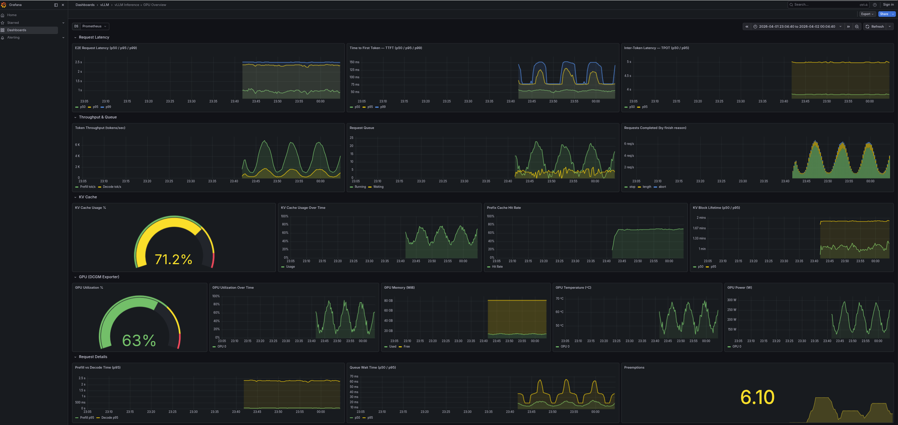

# vLLM Observability Demo

Mock metrics server + Prometheus + Grafana stack for developing vLLM observability dashboards without a GPU.

## What's included

- **mock_vllm_metrics.py** — Python server that emits realistic vLLM Native Prometheus metrics (`:8000/metrics`) and DCGM Exporter metrics (`:9400/metrics`). Values drift over time to simulate a live inference workload.
- **docker-compose.yaml** — Prometheus + Grafana stack (podman-compatible with SELinux `:z` mounts)
- **grafana/** — Pre-provisioned datasource and dashboard configs

## Metrics

| Source | Port | Example metrics |
|--------|------|-----------------|
| vLLM Native Prometheus | `:8000` | `vllm:request_success_total`, `vllm:time_to_first_token_seconds`, `vllm:num_requests_running` |
| DCGM Exporter | `:9400` | `DCGM_FI_DEV_GPU_UTIL`, `DCGM_FI_DEV_FB_USED`, `DCGM_FI_DEV_POWER_USAGE` |

## Dashboard Preview



| Row | Section | Source |
|-----|---------|--------|
| 1 | Request Latency | vLLM Native Prometheus |
| 2 | Throughput & Queue | vLLM Native Prometheus |
| 3 | KV Cache | vLLM Native Prometheus |
| 4 | GPU (DCGM Exporter) | DCGM Exporter |
| 5 | Request Details | vLLM Native Prometheus |

## Quick start

```bash
# 1. Start the mock metrics server
python mock_vllm_metrics.py

# 2. Start Prometheus + Grafana
podman-compose up -d
# or: docker compose up -d

# 3. Open Grafana
open http://localhost:3000    # admin/admin
```

Prometheus is available at `http://localhost:9091`.

## Requirements

- Python 3
- Podman with podman-compose (or Docker with docker-compose)
